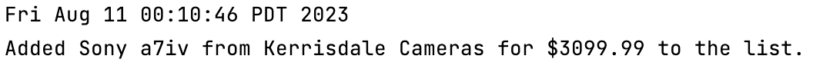
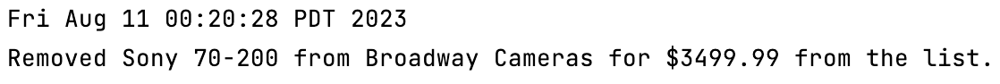
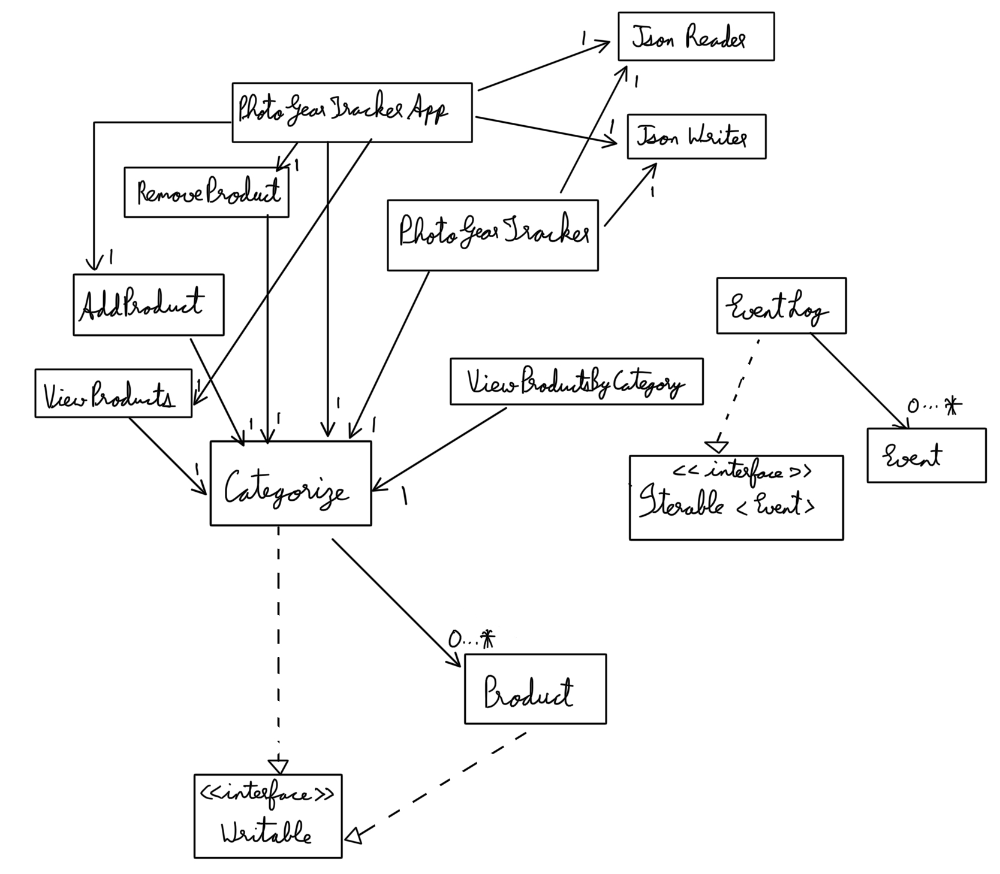

# 
 My Personal Project

> ## 
 <u> PhotoGearTracker </u> 

> #### 
 *Seamless Camera Equipment Tracking System*

The aim of this application is that it serves as a tool for users to keep track of their photography equipment that they
intend to purchase. It allows users to input and manage details of the gear they are interested in, such as brand,
price, model number, and shop name. Additionally, users can select categories from a predefined list to categorize their
desired items.

The application will primarily be used :

- **Photography enthusiasts and professionals who want to keep a comprehensive record of their photography gear.**
- **Individuals who are interested in purchasing photography equipment.**
- **Users who enjoy organizing and managing their equipment information efficiently.**
- **People who frequently research and compare various equipment options before making buying decisions.**

As a photography enthusiast, I understand the excitement and sometimes overwhelming process of researching and choosing
photography equipment. It allows me to combine my technical skills with my personal interests, creating a useful tool
for users in creating a comprehensive wishlist that they can refer to when making purchasing decisions.

## User Stories

- As a user, I want to be able to add equipment details (like Brand Name, Model Number, Price, Retailer Name etc.)
- As a user, I want to be able to view the list of my photography equipments.
- As a user, I want to be able to categorize my equipments by selecting a category from a predefined list.
- As a user, I want to be able to view my equipment list by category.
- As a user, I want to be able to delete products from my list.
- As a user, I want to be able to clear all products from my list.
- As a user, I want to be able to save my data while using the application and also while quitting the application.
- As a user, I want to be able to load my data that was previously saved.

## Phase 4: Task 2

- When the user adds a new Product to the list of products, an Event gets added to the EventLog. 
  - Example: Adding new product with details (Brand: Sony, Model: a7iv, Retailer: Kerrisdale Cameras, Price: 3099.99, 
  Category: Mirrorless), the Event prints on the console like:
  

  
  
- When the user removes a Products from the list of products, an Event gets added to the EventLog.
  - Example: Removing a product with details (Brand: Sony, Model: 70-200, Retailer: Broadway Cameras, Price: 3499.99,
  Category: Lens), the Event prints on the console like:

## Phase 4: Task 3

- I would do refactoring between ViewProducts and ViewProductsByCategory because the only difference between both
of those classes is just the way the list is being printed and a single button. Maybe I will create a new class in which
it contains all the main methods and both of these classes will extend that new class and Override the printing method.